# EveryFrame — System Architecture & Diagrams

This document is the technical reference for implementation. It reflects the approved UX (`docs/everyframe-ux-mockup.html` and the published design canvas) including the expanded scope agreed during design review: multi-user accounts with login/session/MFA, a per-login legal disclaimer, an onboarding nudge, date-range + weekday + time-window scheduling, and storage archiving to a local folder past a configurable threshold.

This supersedes the single-user assumptions in `docs/everyframe-claude-code-kickoff-prompt.md` and `docs/everyframe-handout-brief.md` on exactly one point — auth/multi-user is now in scope. Everything else in those documents (CDP-attach tab targeting, Node/TS/Fastify/SQLite stack, "keep the footprint small" ethos, single tab→channel pair per user) still holds.

## 1. Key architectural decision: shared Chrome, isolated accounts

CDP attach (`playwright.chromium.connectOverCDP`) only reaches a Chrome instance on the same machine as the backend process. Multi-user accounts do **not** mean multiple Chrome instances or multiple machines — that would require a remote-agent architecture, which is out of scope here.

**Assumption (flag if wrong): all users share one Chrome instance on the machine running the EveryFrame backend.** The `GET /api/cdp/targets` list is the same for every logged-in user; each user independently picks a tab from that shared list and gets fully isolated config, schedule, and capture history. If genuinely separate machines per user are needed later, that's a distinct project (a lightweight per-user relay agent), not an extension of this one.

## 2. Tech stack (extends the original locked stack)

Unchanged: Node.js + TypeScript, Fastify, `playwright` (chromium, `connectOverCDP`), `setInterval`-per-job scheduler, raw `fetch` to the Telegram Bot API, SQLite via `better-sqlite3`, React + Vite frontend, REST + WebSocket.

Added for auth/session/MFA/storage:
- **Password hashing:** `argon2`
- **Sessions:** `@fastify/session` + `@fastify/cookie`, backed by a small SQLite-backed session store (no Redis — same "keep the footprint small" reasoning as the original brief)
- **MFA:** `otplib` (TOTP) for codes, `qrcode` for enrollment QR generation, plus hashed one-time recovery codes. Enrollment encodes a standard `otpauth://totp/...` URI (RFC 6238) — works with Google Authenticator, Microsoft Authenticator, or any standard TOTP app, with no per-app special-casing needed.
- **Login hardening:** `@fastify/rate-limit` on `/api/auth/*`, `@fastify/csrf-protection` on state-changing routes
- **Frontend routing/code-splitting:** React Router, with `Login`, `Settings`, and `Storage` routes loaded via `React.lazy` + `Suspense` so they aren't in the initial bundle for the main capture screen ("accessible on lazy load")
- **Structured server logging:** Fastify's built-in Pino logger, writing full-detail logs (including stack traces) to disk/console for developers — separate from the sanitized, user-facing `ACTIVITY_LOG` table described in §5 and §11

## 2a. Two-tier error logging

Every error is logged twice, at two different levels of detail, for two different audiences:

1. **Full detail, developer-facing:** every caught exception goes through Pino (stack trace, internal error codes, request context). Lives in server logs only — never reaches the API or the browser.
2. **Sanitized summary, user-facing:** the same error also gets a short, human-readable summary written to `ACTIVITY_LOG` (capture failures instead use `CAPTURE_LOG.error_message`, already sanitized by the same rule) and surfaced in **Settings → Logs**. Never includes secrets, raw stack traces, or internal identifiers — the same "never leak the bot token" discipline the original brief already established, generalized to all errors.

`ACTIVITY_LOG` also carries non-error events worth showing the user: schedule configuration changes. It deliberately does **not** duplicate Telegram-send events — those already live in `CAPTURE_LOG` with full status/error detail. The Settings → Logs page merges both tables into one chronological, filterable view (see §11).

## 3. High-level system design

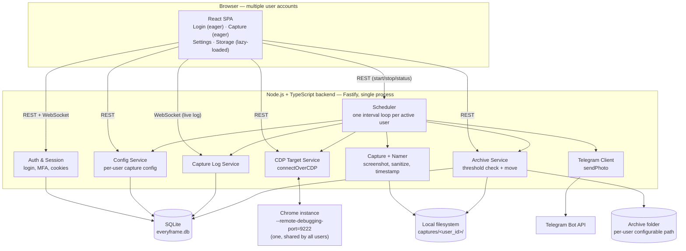

## 4. Low-level component diagram (backend module boundaries)

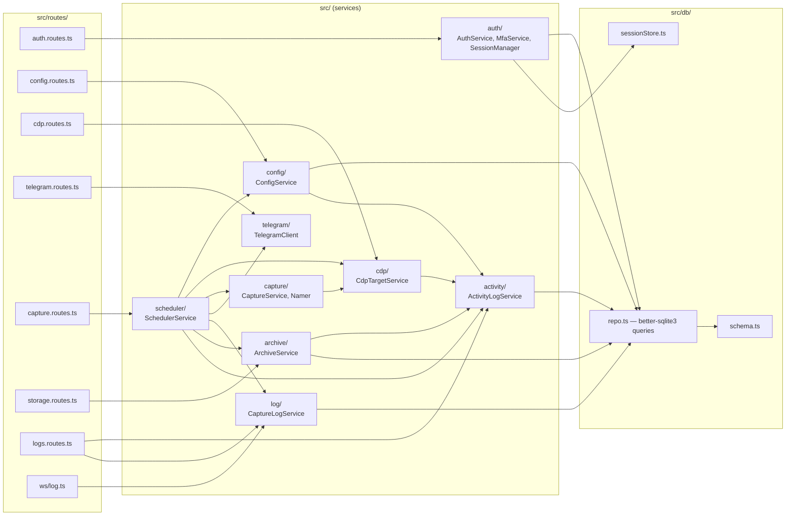

## 5. Entity-relationship diagram

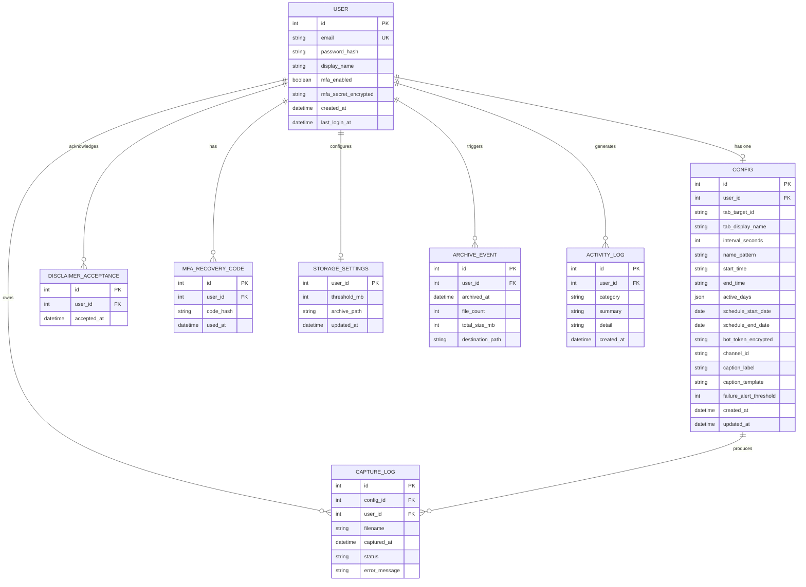

Notes:
- `CONFIG.user_id` is unique — one tab/channel pair per user, per original scope (unchanged; multi-pair-per-user is still out of scope).
- `STORAGE_SETTINGS.user_id` is both primary key and foreign key to `USER` (one row per user).
- `active_days` stores a JSON array of weekday ids (`["mon","tue",...]`).
- `bot_token_encrypted` / `mfa_secret_encrypted`: AES-256-GCM at rest, per the original brief's "keep secrets out of plaintext where reasonable" guidance.
- `caption_label` / `caption_template`: drive the Telegram photo caption (see §9.1). `caption_template` default: `"{label} generated at {time} on {date}"`, with `{label}` filled from `caption_label` (defaults to the tab's display name, user-editable) and `{time}`/`{date}` computed at send time.
- `failure_alert_threshold`: consecutive failed ticks (capture failure, or delivery failure after its one retry) before the scheduler auto-pauses the job and sends a one-time Telegram text alert. Default `3`; `0` disables the behavior entirely. See §7.2 and §11.
- **`CAPTURE_LOG` never stores the screenshot's binary content — only the filename reference.** The image lives solely in `captures/<user_id>/` (and later, the archive folder). The caption actually sent isn't persisted either: it's reconstructible from `captured_at` + the `Config` row's `caption_label`/`caption_template` at the time, so it isn't duplicated into the log.
- `ACTIVITY_LOG.category` is `'error'` or `'schedule_change'` (extensible later). `summary` is the short, sanitized line shown in the UI; `detail` is optional extra sanitized context (e.g. which schedule fields changed) — never a raw stack trace or a secret. See §2a and §11.

## 6. Class diagram (backend domain/service classes)

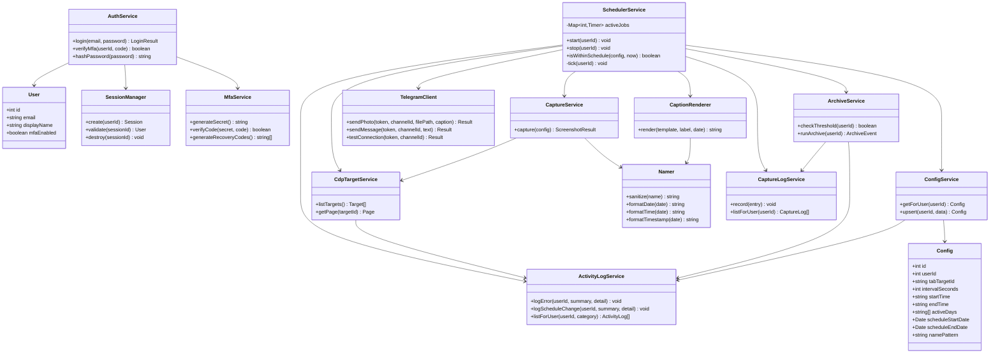

## 7. Activity diagrams

### 7.1 Login → disclaimer → onboarding

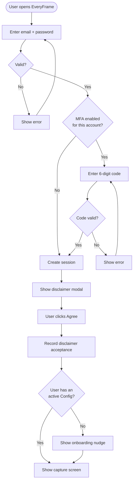

### 7.2 Scheduler tick / capture cycle

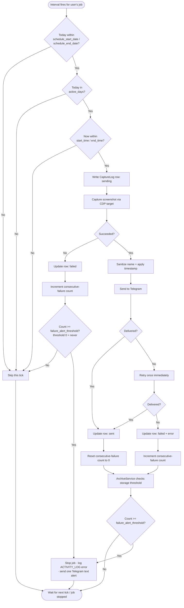

### 7.3 Storage archive run

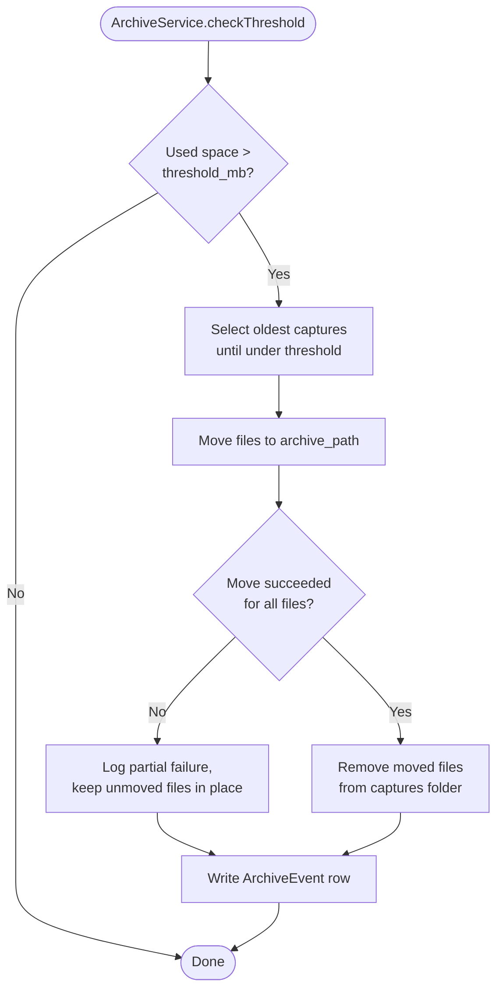

## 8. State diagrams

### 8.1 CaptureLog row status

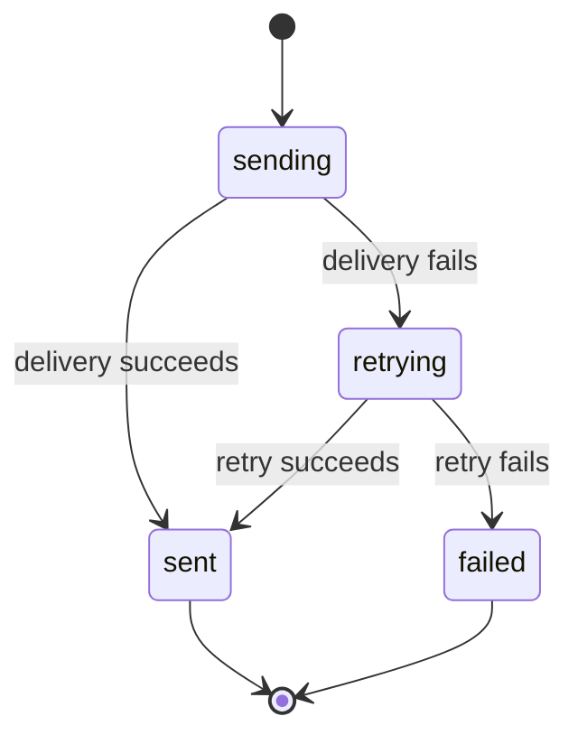

### 8.2 Per-user scheduler job

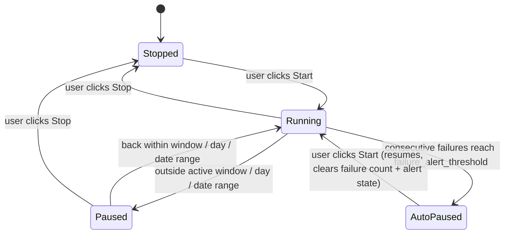

`AutoPaused` is distinct from the schedule-window `Paused` above: it's a hard stop the scheduler makes itself, not a normal outside-the-window skip, and it comes with a logged reason (`ACTIVITY_LOG`) and a one-time Telegram text alert (see §7.2, §11).

### 8.3 Session / auth lifecycle

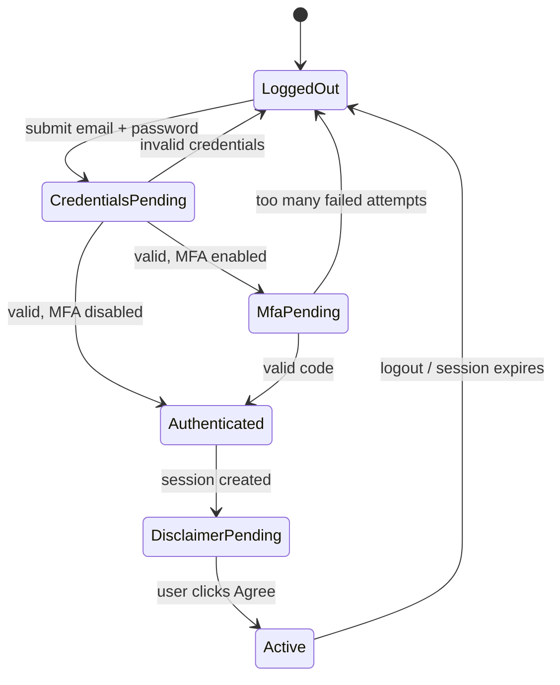

## 9. Sequence diagrams

### 9.1 Capture + send (one scheduler tick, window/day/date checks already passed)

```mermaid
sequenceDiagram
    participant S as SchedulerService
    participant C as CdpTargetService
    participant Ch as Chrome (CDP)
    participant N as Namer
    participant Cp as CaptionRenderer
    participant FS as Filesystem
    participant T as TelegramClient
    participant TG as Telegram API
    participant L as CaptureLogService
    participant DB as SQLite

    S->>L: insert row (status: sending)
    L->>DB: INSERT CaptureLog
    S->>C: getPage(targetId)
    C->>Ch: CDP screenshot command
    Ch-->>C: PNG buffer
    C-->>S: buffer
    S->>N: sanitize(name) + formatTimestamp(now)
    N-->>S: filename
    S->>FS: write captures/&lt;user_id&gt;/&lt;filename&gt;
    S->>Cp: render(config.caption_template, config.caption_label, now)
    Cp-->>S: caption text
    S->>T: sendPhoto(token, channelId, filepath, caption)
    T->>TG: POST sendPhoto
    TG-->>T: 200 OK / error
    T-->>S: result
    alt delivered
        S->>L: update row (status: sent)
    else failed
        S->>T: retry sendPhoto once
        T->>TG: POST sendPhoto
        TG-->>T: 200 OK / error
        T-->>S: result
        S->>L: update row (sent | failed + error)
    end
    L->>DB: UPDATE CaptureLog
```

### 9.2 Login + MFA

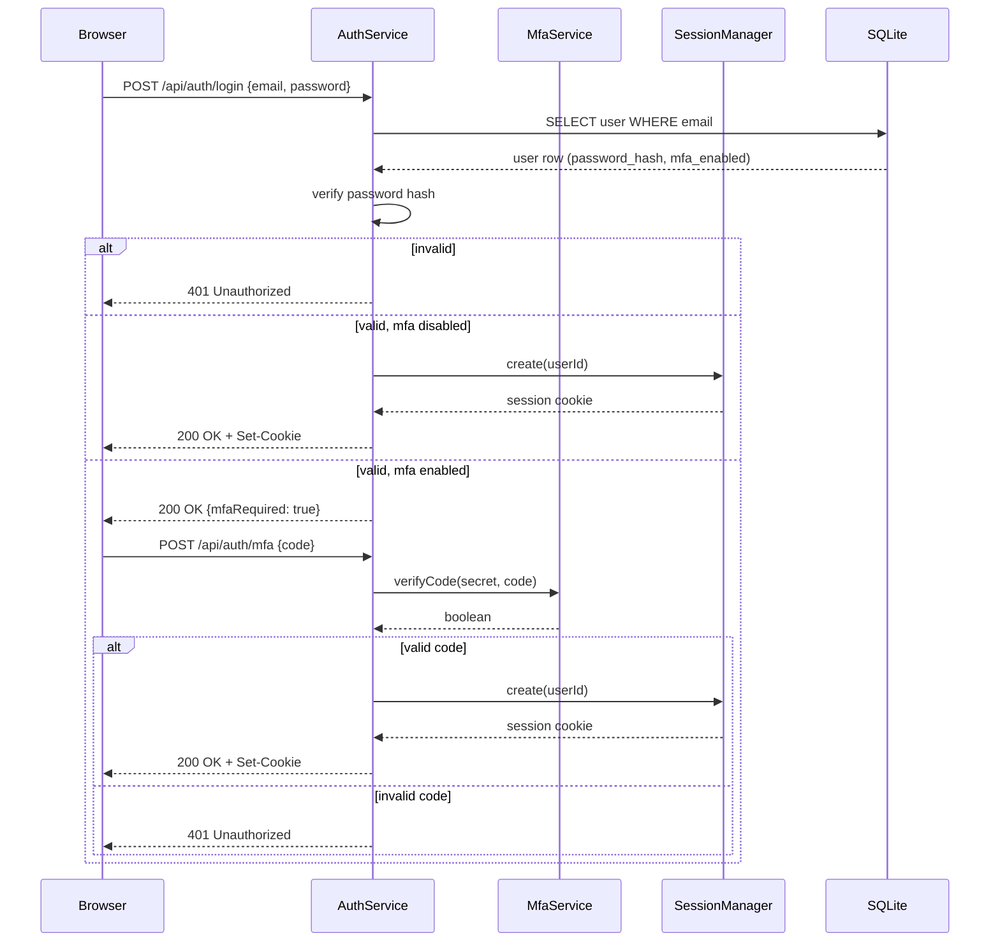

## 10. Settings → Logs

A new sub-menu under Settings, alongside Profile and Security. It merges three sources into one chronological, filterable timeline scoped to the logged-in user — nothing here is ever cross-user:

- `ACTIVITY_LOG` rows where `category = 'error'` — sanitized system-level errors (CDP connection lost, archive failure, etc.)
- `ACTIVITY_LOG` rows where `category = 'schedule_change'` — "capture schedule updated," written whenever `ConfigService.upsert()` succeeds
- `CAPTURE_LOG` rows — every Telegram send attempt, already carrying filename, timestamp, and status/error

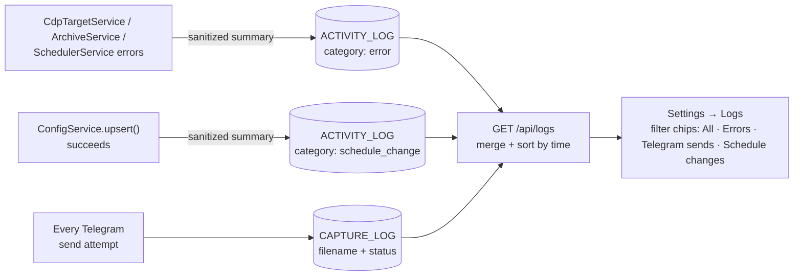

Each row shows a timestamp, a category chip (color-coded — brick for errors, teal for a successful Telegram send, brick for a failed one, amber/neutral for a schedule change), and the summary text (plus filename, for capture rows). No raw stack traces or secrets ever reach this page — see §2a.

## 11. Confirmed decisions and open items

Confirmed:
- **Timezone:** schedule times (`start_time`/`end_time`, weekday checks) are interpreted in the server's local timezone. No per-user timezone setting in this iteration.
- **Recovery codes:** MFA enrollment issues one-time recovery codes (hashed at rest) as a standard TOTP safety net.
- **Disclaimer audit log:** each "Agree" click is recorded (`DISCLAIMER_ACCEPTANCE`) with a timestamp.
- **MFA app support:** standard TOTP (`otpauth://` URI) — Google Authenticator, Microsoft Authenticator, or any RFC 6238 app works, no special-casing per app.
- **No screenshot binary in the log:** `CAPTURE_LOG` and any Telegram-send record hold only the filename, never the image bytes (see §5).
- **Telegram caption:** each send includes a caption rendered from the user's `caption_template`/`caption_label` at send time (see §5, §9.1).
- **User-visible logs:** Settings → Logs shows sanitized error summaries, Telegram send history, and schedule-change events, merged and filterable (see §10). Full error detail stays server-side in Pino logs only (see §2a).
- **Failure alerting & auto-pause:** added after a competitive scan of similar open-source tools (`changedetection.io` and smaller Telegram screenshot bots) surfaced a real gap — EveryFrame's whole point is unattended background capture, but a dead tab or broken bot token previously just failed silently in Settings → Logs, with no way to notice unless the user happened to check. Now, `Config.failure_alert_threshold` (default 3, 0 = disabled) counts consecutive failed ticks; on hitting it, `SchedulerService` stops the job, writes an `ACTIVITY_LOG` entry, and sends one plain-text Telegram message via `TelegramClient.sendMessage()` explaining what happened — using the same bot/channel already configured, so no new credentials are needed. The job stays stopped until the user fixes the issue and presses Start again (§8.2's `AutoPaused` state), which also resets the failure count. The alert send is best-effort: if Telegram itself is unreachable, the pause and its reason are still recorded locally.

Still open:
- **Shared Chrome instance:** see §1 — the single biggest architectural assumption introduced by going multi-user. Confirm before building the tab picker against multi-user data.
- **Session store:** SQLite-backed rather than in-memory, so sessions survive a backend restart (consistent with "no Redis" but still durable).
